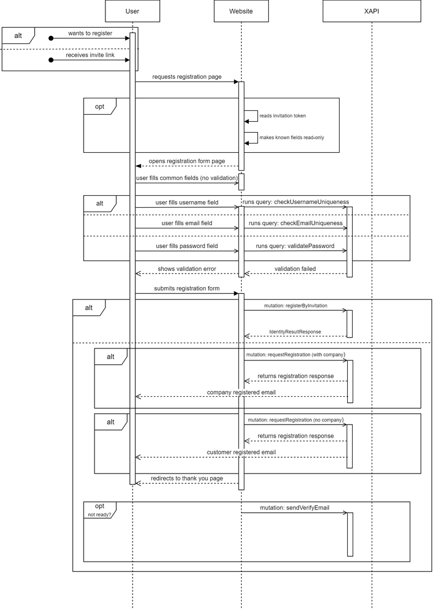

# Overview

The X-Profile module provides high performance search queries for customer and company data.

## Key Features
Through X-Profile, you can perform create, read, update, and delete (CRUD) operations with **users**, **companies**, and **contacts**.
All such operations can be completed with various queries, which are listed and detailed in the sections below.

## How It Works
Just like other xAPI modules, X-Profile resides on a website's or application's back end and is managed with queries. It enables efficiently creating, updating, and deleting various entity profiles. The chart below shows how X-Profile works in case of creating a new user (customer):



## QueryRoot
List of available queries:

|#|Endpoint|Arguments|Return|
|-|-|-|-|
|1|[organization](#organization)|`id`|Organization|
|2|[contact](#contact)|`id`|Contact|
|3|[role](#role)|`roleName`|Role|
|4|[user](#user)|`id` `userName` `email` `loginProvider` `providerKey`|User|

### Organization
With this query, you can get the organization (company) by its ID:

```
{
  organization(id: "689a72757c754bef97cde51afc663430") {
    id
    name
    ownerId
    parentId
    businessCategory
    addresses {
      name
      addressType
      isDefault
    }
    defaultBillingAddress {
      name
    }
    defaultShippingAddress {
      name
    }
  }
}
```

### Contact
With this query, you can get the contact by its ID:

```
{
  contact(id: "5f807280-bb1a-42b2-9a96-ed107269ea06") {
    id
    fullName
    memberType
    name
    organizationId
    emails
    organizations {
      name
    }
    addresses {
      name
      addressType
      isDefault
    }
    defaultBillingAddress {
      name
    }
    defaultShippingAddress {
      name
    }
  }
}
```

### Role
With this query, you can get the role by its name:

```
{
  role(roleName: "Store administrator") {
    id
    name
    permissions
  }
}
```

### User
With this query, you can get the user by a few arguments

```
{
  user(id: "9b605a3096ba4cc8bc0b8d80c397c59f") {
    accessFailedCount
    contact {
      id
      name
    }
    createdDate
    email
    isAdministrator
    passwordHash
  }
}
```

## Queryable Objects
This **Profile type schema** represents queryable objects for X-Profile:


## Mutations
List of mutations:

|#|Endpoint|Arguments|Description|
|-|-|-|-|
|1|[createContact](#createcontact)|`id` `name!` `memberType` `addresses` `phones` `emails` `groups` `fullName` `firstName!` `lastName!` `middleName` `salutation` `photoUrl` `timeZone` `defaultLanguage` `organizations`|Creates a contact (obsolete, use [registrationRequest](#registrationRequest))|
|2|[updateContact](#updatecontact)|`id!` `name` `memberType` `addresses` `phones` `emails` `groups` `fullName` `firstName!` `lastName!` `middleName` `salutation` `photoUrl` `timeZone` `defaultLanguage` `organizations`|Updates a contact|
|3|[deleteContact](#deletecontact)|`contactId!`|Deletes a contact|
|4|[lockOrganizationContact](#lockOrganizationContact)|`userId!`|Set _Locked_ status to a specified contact|
|5|[unlockOrganizationContact](#unlockOrganizationContact)|`userId!`|Set _Approved_ status to a specified contact|
|6|[createUser](#createuser)|`id` `email` `createdBy` `createdDate` `isAdministrator` `lockoutEnabled` `lockoutEnd` `logins` `memberId` `password` `phoneNumber` `phoneContactConfirmed` `photoUrl` `roles` `storeId` `twoFactorEnabled` `userName` `userType`|Creates a user|
|7|[updateUser](#updateuser)|`accessFailedCount` `email!` `id!` `isAdministrator` `lockoutEnabled` `lockoutEnd` `memberId` `phoneNumber` `phoneNumberConfirmed` `photoUrl` `roles` `storeId` `twoFactorEnabled` `userName!` `userType!` `passwordHash` `securityStamp!`|Updates a user|
|8|[changeOrganizationContactRole](#changeOrganizationContactRole)|`userId! roleIds!`|Assign roles to a specified user|
|9|[deleteUsers](#deleteusers)|`userNames!`|Delete users|
|10|[updateAddresses](#updateaddresses)|`contactId!` `addresses!`|Update an addresses|
|11|[createOrganization](#createorganization)|`id` `name` `memberType` `addresses` `phones` `emails` `groups`|Creates an organization (obsolete, use [registrationRequest](#registrationRequest))|
|12|[updateOrganization](#updateorganization)|`id!` `name` `memberType` `addresses` `phones` `emails` `groups`|Updates an organization|
|13|[updateRole](#updaterole)|`concurrencyStamp` `id!` `name!` `description` `permissions!`|Updates a role|
|14|[registrationRequest](#registrationRequest)|`storeId!` `company!` `contact` `account`|Registers customer or company|

### CreateContact
#### Query:

```
mutation($command: InputCreateContactType!) {
  createContact(command: $command) {
    id
    name
    firstName
    lastName
  }
}
```

#### Variables:

```
{
  "command": {
  "firstName": "testGraphQlFirstName",
  "lastName": "testGraphQlLastName",
  "name": "testGraphQlName",
  "dynamicProperties": [
      {
          "name": "Default shipping address",
          "value": "test value"
      }
    ]
  }
}
```

### UpdateContact
#### Query:

```
mutation($command: InputUpdateContactType!){
  updateContact(command: $command) {
    id
    name
  }
}
```

#### Variables:

```
{
  "command": {
    "id": "550e9b14-ddde-46fe-bc28-0afec83ade96",
    "firstName": "testGraphQlFirstName2",
    "lastName": "testGraphQlLastName2",
    "dynamicProperties": [
      {
          "name": "Default shipping address",
          "value": "test value"
      }
    ]
	}
}
```

### DeleteContact
#### Query:

```
mutation($command: InputDeleteContactType!){
  deleteContact(command: $command)
}
```
#### Variables:
```
{
  "command": {
    "contactId": "550e9b14-ddde-46fe-bc28-0afec83ade96"
  }
}
```

### LockOrganizationContact
#### Query:

```
mutation lockContact($command: InputLockUnlockOrganizationContactType!){
  lockOrganizationContact(command: $command){
  }
}
```
#### Variables:
```
{
  "command": {
    "userId":"5f807280-bb1a-42b2-9a96-ed107269ea06"
  }
}
```

### UnlockOrganizationContact
#### Query:

```
mutation unlockContact($command: InputLockUnlockOrganizationContactType!){
  unlockOrganizationContact(command: $command){
  }
}
```
#### Variables:
```
{
  "command": {
    "userId":"5f807280-bb1a-42b2-9a96-ed107269ea06"
  }
}
```

### CreateUser
#### Query:

```
mutation($command: InputCreateUserType!) {
  createUser(command: $command) {
    succeeded
  }
}
```

#### Variables:

```
{
  "command": {
    "email": "graphql@test.local",
    "userName": "graphqlTestUserName",
    "userType": "Customer"
  }
}
```

### UpdateUser
#### Query:

```
mutation($command: InputUpdateUserType!) {
  updateUser(command: $command) {
    succeeded
    errors{
      code
      description
    }
  }
}
```

#### Variables:

```
{
  "command": {
    "id": "ae6f1cd7-957d-4b30-864c-8f40232a4df3",
    "userName": "graphqlTestUserName2",
    "userType": "Manager",
    "securityStamp": "",
    "email": "graphql2@test.local"
  }
}
```

> SecurityStamp is a random value that must change whenever user credentials, i.e. login or password, change.

### ChangeOrganizationContactRole
#### Query:
```
mutation changeOrganizationContactRole($command:  InputChangeOrganizationContactRoleType!){
  changeOrganizationContactRole(command:$command){
    succeeded
    errors
    {
      code
      description
    }
  }
}
```

#### Variables:
```
{
  "command":
  {
    "userId": "237a4784-d25f-419e-b4d7-cf151393d1cc",
    "roleIds": ["org-maintainer","purchasing-agent"]
	}
}
```

### DeleteUsers
#### Query:

```
mutation($command: InputDeleteUserType!) {
  deleteUsers(command: $command) {
    succeeded
    errors{
      code
      description
    }
  }
}
```

#### Variables:

```
{
  "command": {
    "userNames": ["graphqlTestUserName2"]
  }
}
```

### UpdateAddresses
#### Query:

```
mutation($command: InputUpdateContactAddressType!) {
  updateAddresses(command: $command) {
    addresses {
      addressType
    }
  }
}
```

#### Variables:

```
{
  "command": {
    "contactId": "820c58c5-b518-454b-aefd-2fc4616bd25e",
    "addresses": [
      {
        "countryCode": "testCountryCode",
        "countryName": "testCountryName",
        "line1": "testLine1",
        "postalCode": "testPostalCode",
        "city": "testCity",
        "addressType": 3
      }
    ]
  }
}
```

> Address type: **1** stands for Billing, **2**, for Shipping, and **3**, for BillingAndShipping

### CreateOrganization
#### Query:

```
mutation($command: InputCreateOrganizationType!) {
  createOrganization(command: $command) {
    id
    name
    memberType
  }
}
```

#### Variables:

```
{
  "command": {
    "name": "testOrganizationName",
    "emails": ["testOrg.graphql.local"],
    "dynamicProperties": [
      {
          "name": "Sector,
          "value": "test value"
      }
    ]
  }
}
```

### UpdateOrganization
#### Query:

```
mutation($command: InputUpdateOrganizationType!) {
  updateOrganization(command: $command) {
    id
    name
    memberType
  }
}
```

#### Variables:

```
{
  "command": {
    "id": "5385b5b7-1772-4c08-8596-27503b8fdddd",
    "name": "EditedTestOrganization",
    "emails": ["test@graphql.local2"],
    "dynamicProperties": [
      {
          "name": "Sector,
          "value": "test value"
      }
    ]
  }
}
```

### UpdateRole
#### Query:

```
mutation($command: InputUpdateRoleType!) {
  updateRole(command: $command) {
    succeeded
    errors {
      code
      description
    }
  }
}
```

#### Variables:

```
{
  "command": {
    "id": "e75700bb597948cca7962e0bbcfdb97c",
    "name": "Use api",
    "permissions": [
      {
      	"name": "platform:setting:read"
      },
      {
        "name": "catalog:create"
      }
    ],
    "concurrencyStamp": ""
  }
}
```

> ConcurrencyStamp is a random value that must get changed whenever a role is assigned to the store.

### RequestRegistration
#### Query:

```
mutation requestRegistration (command: InputRequestRegistrationType!) {
    registrationRequest(command: $command) {
        organization {
            id
            name
            status
            createdBy
            ownerId
        }
        contact {
            id
            name
            status
            createdBy
        }
        account {
            id
            username
            email
            status
        }
        result {
            succeede
            errors
        }
    }
}
    
```

#### Variables:

```
{
  "command": {
    "storeId": "store_id",
    "contact": {
      "firstName": "first_name",
      "lastName": "last_name",
      "phoneNumber": "phone_number"
    },
    "organization": {
      "name": "company_name"
      "description": "description"
      "address": {
        "city": "City"
        "countryCode":"USA"
        "countryName":"United States"
        "email":"e@mail.test"
        "firstName":"First_name"
        "lastName:"Last_name"
        "line1":"line1"
        "postalCode":"123654"
      }
    }
    "account": {
      "username": "user_name",
      "password": "password",
      "email": "e@mail.test" 
    }
  }
}
```

> The mutation registers a company when all argumets have been provided, and registers a customer only when the company value is null. If a company is created, the customer becomes its member and owner. In this case customer gets the **Organization maintainer** role whose name or ID must be provided in **appsettings.json**.
>
> The user that creates a company and/or customer is always displayed as *frontend*.
>
> The company status is determined by the *Company default status* store setting, while contact and account statuses come from the *Contact default status* setting. Both settings must be provided in advance.
>
> Example of the role name settings provided below.

```
{
...
    "FrontendSecurity": {
            "OrganizationMaintainerRole": "Organization maintainer"
        },
...
}
```
